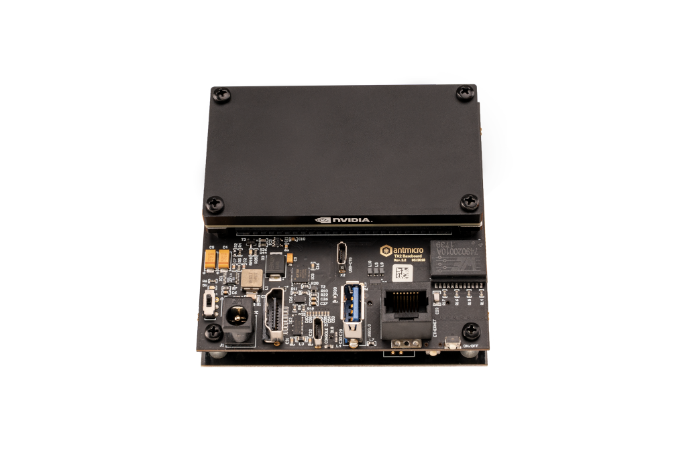

# Antmicro TX2 Deep Learning Platform

Copyright (c) 2016-2023 [Antmicro](https://www.antmicro.com)

## Overview

This project contains open hardware design files for Antmicro's TX2 Deep Learning Platform built around NVIDIA [Jetson TX2 Module](https://developer.nvidia.com/embedded/jetson-tx2).
The TX2 Deep Learning Platform is a small, modular multi-camera kit for the NVIDIA Jetson TX2 module.
It consists of a baseboard and a camera adapter for interchangeable video input modules.
The baseboard is electrically compatible with the NVIDIA Jetson TX2/TXi and legacy TX1 module.
The baseboard offers typical IO interfaces along with miniPCIe/SATA expansion slots.
Thanks to its straightforward design, the camera adapter can be easily adjusted to custom image sensor setups composed of up to 6 independent cameras connected to the TX2 module over the MIPI CSI-2 interface.

## Project structure:

* `Baseboard` - contains PCB design files for the Jetson TX1/TX2/TX2i baseboard along with basic documentation
* `CameraAdapter` - contains PCB design files for the camera adapter, which break-routes the MIPI CSI-2 interfaces from the baseboard on three FFC connectors
* `img` - contains graphics for this README
* `3DModels` - contains files defining the mechanical model of the assembled platform

The PCB projects include basic documentation including schematics, assembly drawings (in the PDF format) along with the bill of material (BOM).
The PCB project files were prepared in Altium Designer 14.1

## Key Features

* USB 3.0 host interface
* HDMI output
* Micro USB OTG connector
* Serial debug console over micro USB
* Configurable mPCIe/mSATA card holder
* Gigabit Ethernet RJ45 connector
* 3x 50-pin FFC camera connectors exposing up to 6 MIPI CSI-2 camera interfaces
* Autostart circuitry
* RTC battery backup
* EEPROM for storing board ID/SN
* CAN interface (optional, not populated by default)
* 12-19V DC supply voltage
* 90 x 90 mm dimensions

## Getting started

The platform can be produced and assembled using the provided design files.
Please, refer to the mechanical layers for more information regarding the PCB stackup recommended for fabrication.
The platform accepts power supply voltage in the 12-19VDC range.
It is recommended to use a 12V 2A DC supply to power the platform.
The baseboard has a slide switch which activates the autostart function.
If the switch is on, the TX2 module will boot automatically. Otherwise, it will start after pressing the power button.
There is a [basic BSP](https://github.com/antmicro/tx2-deep-learning-kit-bsp) released by Antmicro for this hardware platform along with compilation and usage instructions.
The BSP configuration will most likely need to be adjusted for the video accessories used with the TX2 Deep Learning Platform.
Nevertheless, the remaining on-board IO interfaces should be working properly.

## Supported accessories

The TX2 Deep Learning Platform is compatible with a range of video accessories designed by Antmicro.

The board exposes MIPI CSI-2 interfaces using unified 50-pin connectors that are electrically compatible with a variety of video accessories created by Antmicro:

* [SDI-MIPI Video converter](https://github.com/antmicro/sdi-mipi-video-converter)
* [FRAMOS camera adapter](https://github.com/antmicro/framos-csi-adapter)
* [Allied Vision Alvium Camera Adapter](https://github.com/antmicro/alvium-flexible-csi-adapter)
* [HDMI-MIPI bridge](https://github.com/antmicro/hdmi-mipi-bridge)
* [OV9281 Dual camera board](https://github.com/antmicro/ov9281-camera-board)

## License

This project is licensed under the [Apache-2.0](LICENSE) license.
